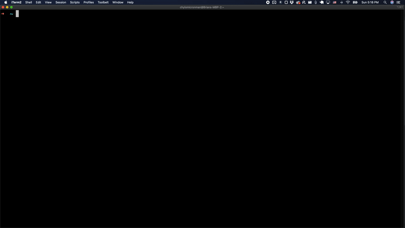

this is a work in progress, please bear with me...

## Remarkable-Times

**purpose**   
You may be interested in using this software or working on the project itself if:   
- you own a [remarkable tablet device](https://remarkable.com/)
- you read the [New York Times newsletters](https://www.nytimes.com/newsletters) 

This code is essentially a collection of scripts (written in Typescript) which are published as an [npm package](https://www.npmjs.com/package/remarkable-times)
and allow you to do the following 
- choose which newsletters you are interested in recieving 
- set up a service on your computer that runs automatically a couple times a day to deliver NYT newsletter content to your remarkable device   
- right now I support Mac and Windows  

**what it is not**   
The fact that this is available as an npm package may cause confusion. This package is not meant to be installed as a dependency to your node project and does not expose a javascript api for your code to use. Instead it is meant to be installed globally on your computer `npm install -g remarkable-times`     
from there, you use the command line to configure it to your liking and going forward newsletters will be delivered automatically to your remarkable device

  

## Getting Started

- `npm i -g remarkable-times`
- `rmt setup` (rmt is a shortened alias so that you don't have to type out remarkable-times)

## Configure your computer so its awake when you want the service to run

## Currently Supported 

todo
